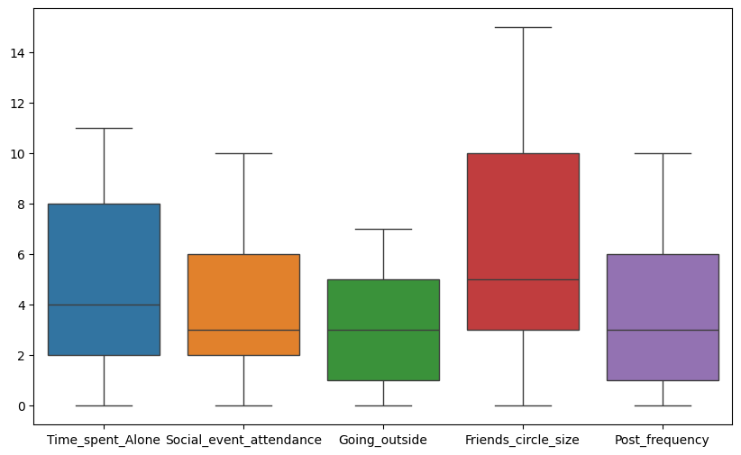
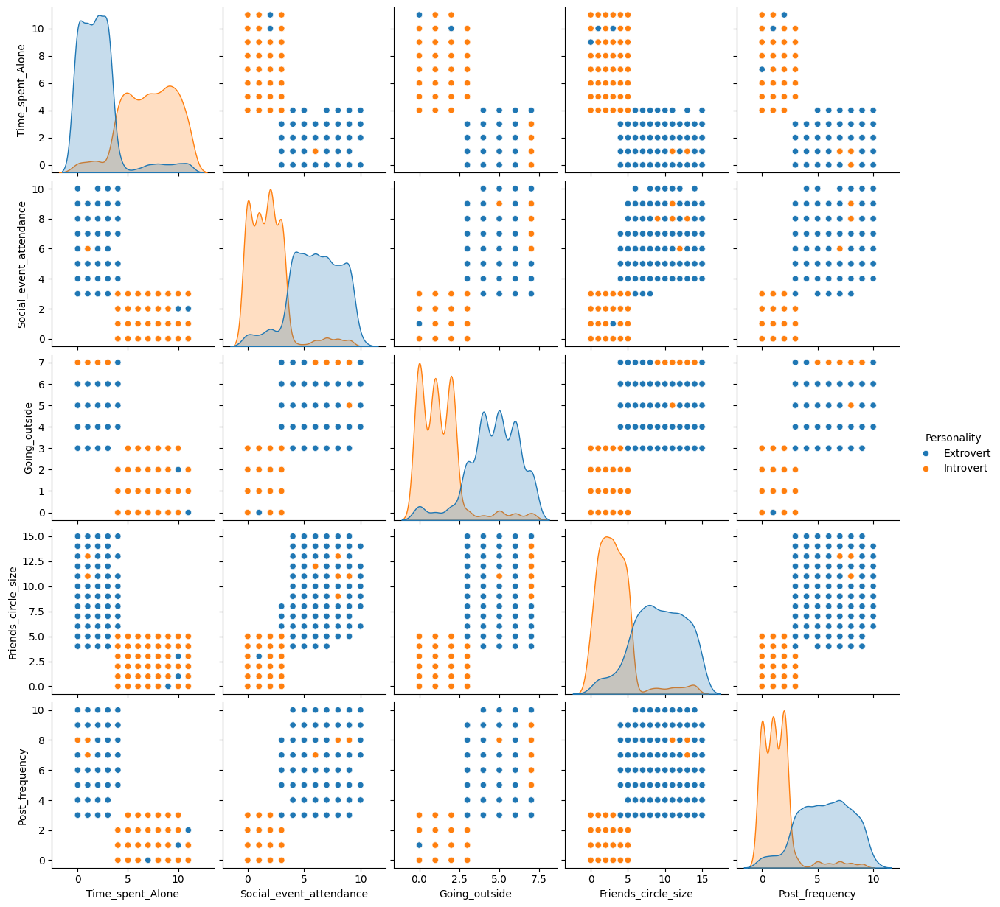
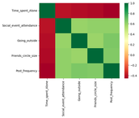
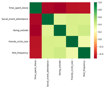
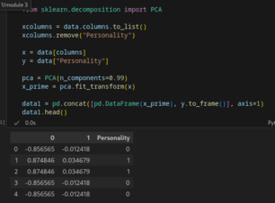
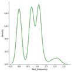
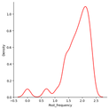

## Dataset Summary

The dataset, [Introverts & Extroverts](https://www.kaggle.com/datasets/rakeshkapilavai/extrovert-vs-introvert-behavior-data?resource=download), contains 2900 entries and 8 columns.

**Dataset Information:**
```
<class 'pandas.core.frame.DataFrame'>
RangeIndex: 2900 entries, 0 to 2899
Data columns (total 8 columns):
 #   Column                     Non-Null Count  Dtype  
---  ------                     --------------  -----  
 0   Time_spent_Alone           2837 non-null   float64
 1   Stage_fear                 2827 non-null   object 
 2   Social_event_attendance    2838 non-null   float64
 3   Going_outside              2834 non-null   float64
 4   Drained_after_socializing  2848 non-null   object 
 5   Friends_circle_size        2823 non-null   float64
 6   Post_frequency             2835 non-null   float64
 7   Personality                2900 non-null   object 
dtypes: float64(5), object(3)
memory usage: 181.4+ KB
```

**Column Descriptions:**

- **Time_spent_Alone**: Hours spent alone daily (0–11).
- **Stage_fear**: Presence of stage fright (Yes/No).
- **Social_event_attendance**: Frequency of social events (0–10).
- **Going_outside**: Frequency of going outside (0–7).
- **Drained_after_socializing**: Feeling drained after socializing (Yes/No).
- **Friends_circle_size**: Number of close friends (0–15).
- **Post_frequency**: Social media post frequency (0–10).
- **Personality**: Target variable (Extrovert/Introvert).

## Data Exploration Plan

1. Calculate the summary statistics for the numerical features. This includes mean, median, mode, std, min, max, and quartiles to understand the distribution of variables.
2. Generate box plots for all numerical fields to visually understand the distribution and summary statistics.
3. Generate pairplots. Pairplots will visualize relationships between all numerical features, colored by the 'Personality' target variable, to identify potential patterns.
4. Generate a correlational heatmap. A correlational heatmap will quantify the linear relationships between numerical features, helping to identify highly correlated variables. This will be generated for each of the two personality types to find patterns specific to Extroverts and Introverts.

## Exploratory Data Analysis (EDA)

### 1. Summary Statistics

| Statistic | Time_spent_Alone | Social_event_attendance |
|-----------|------------------|-------------------------|
| count     | 2837.00          | 2838.00                 |
| mean      | 4.51             | 3.96                    |
| std       | 3.48             | 2.90                    |
| min       | 0.00             | 0.00                    |
| 25%       | 2.00             | 2.00                    |
| 50%       | 4.00             | 3.00                    |
| 75%       | 8.00             | 6.00                    |
| max       | 11.00            | 10.00                   |

| Statistic | Going_outside | Friends_circle_size | Post_frequency |
|-----------|---------------|---------------------|----------------|
| count     | 2834.00       | 2823.00             | 2835.00        |
| mean      | 3.00          | 6.27                | 3.56           |
| std       | 2.25          | 4.29                | 2.93           |
| min       | 0.00          | 0.00                | 0.00           |
| 25%       | 1.00          | 3.00                | 1.00           |
| 50%       | 3.00          | 5.00                | 3.00           |
| 75%       | 5.00          | 10.00               | 6.00           |
| max       | 7.00          | 15.00               | 10.00          |

We observe that the standard deviation is significantly skewed for all fields (abs(skew) > 0.75).

### 2. Box Plot





We don't observe any outliers, which makes sense since our metrics are bounded for all fields.

### 3. Pairplots





We see that for all features there exists a significant clustering separating the introverts from the extroverts, this tells us that the KNN algorithm could help significantly with predicting the target. We also notice that most features are highly correlated.

### 4. Correlational Heatmap






We observe that features are more correlated for introverts than extroverts. **Time_spent_Alone** is a significant indicator for both extroverts and introverts.

## Data Cleaning and Feature Engineering

1. The null values that in this dataset encompus almost every column and there is no simple pattern to fill them, we could do knn. but if we dropp all rows with null values, we then remain with 2477 entries, which means we removed 423 entries. This isn't a significant, so we'll be going with that approach

2. We'll be log transforming the numerical fields to fix the skew and have normally distributed data, we'll be using log1p since we can have values of 0

3. We'll be using binary encoding for the fields **Stage_fear**, **Drained_after_socializing** and **Personality**

    | Time_spent_Alone | Stage_fear | Social_event_attendance | Going_outside |
    |------------------|------------|-------------------------|---------------|
    | 1.609438         | 0          | 1.609438                | 1.945910      |
    | 2.302585         | 1          | 0.000000                | 0.000000      |
    | 2.302585         | 1          | 0.693147                | 1.098612      |
    | 0.000000         | 0          | 1.945910                | 2.079442      |
    | 1.386294         | 0          | 2.302585                | 1.609438      |

    | Drained_after_socializing | Friends_circle_size | Post_frequency | Personality |
    |---------------------------|---------------------|----------------|-------------|
    | 0                         | 2.639057            | 1.791759       | 0           |
    | 1                         | 0.000000            | 1.386294       | 1           |
    | 1                         | 1.791759            | 1.098612       | 1           |
    | 0                         | 2.708050            | 2.197225       | 0           |
    | 0                         | 2.197225            | 1.791759       | 0           |

\newpage

4. Using PCA we can explain 99% of the variance with 2 principle components, dropping our feature count from 7 to 2



## Key Findings and Insights

*   **Personality Clustering**: Pairplots revealed distinct clustering between introverts and extroverts across all features, indicating that these features are strong predictors of personality type. This suggests that algorithms like K-Nearest Neighbors (KNN) could be highly effective for personality prediction.
*   **Feature Correlation Patterns**: Features exhibited stronger correlations for introverts compared to extroverts. This difference in correlation patterns between the two personality types is a significant insight.
*   **"Time_spent_Alone" as a Key Indicator**: The feature "Time_spent_Alone" was identified as a significant indicator for both extroverts and introverts, highlighting its importance in distinguishing between the two personality types.
*   **Dimensionality Reduction Effectiveness**: Through PCA, it was discovered that 99% of the dataset's variance could be explained by just two principal components. This indicates that the data can be effectively represented in a much lower dimension while retaining almost all its information, which is crucial for model efficiency and interpretability.

\newpage
## Hypothesis Formation

1.  The mean post frequency is more for introverts than extroverts.
2.  There isn't a significant difference for people having stage fright between introvers and extroverts
3.  The mean size of an extrovert's friend circle is larger than an introvert's.

## Hypothesis Testing & Significance Analysis

We are going to be testing: The mean post frequency is more for introverts than extroverts. The intuition being that since introverts spend more time on their own, they are more likely to spend more time online which could mean they post more.

- Our null hypothesis ($H_0$): the mean post frequency for introverts is more than extroverts ($\mu_{introvert} > \mu_{extrovert}$)

- Our alternative hypothesis ($H_A$): the mean post frequency for extroverts is equal to or more than introverts ($\mu_{extrovert} \ge \mu_{introvert}$)

Since we have a contrasting hypothesis, we'll be using the Neyman-Pearson Interpretation of $H_0$ and $H_1$.

We'll be setting our significance level $\alpha = 5\%$.

Since we don't know the standard deviation for the population, we'll be using a t-test since we have a large sample size.

The '<' sign in the alternative hypothesis indicates the test is left-tailed.

### Introvert Distribution




### Extrovert Distribution




- $\mu_{introvert} = 0.71$
- $\mu_{extrovert} = 1.79$
- $t = -51.5$
- $p = 0.0$

Looking at the density distribution, we can already get a strong indicator that our null hypothesis is false. Doing further calculation on the mean values, we can see that $\mu_{extrovert}$ is a whole page frequency more, and finally, doing the test, we get a p-value of 0, which is below our significance level of 5%. So it is clear we can reject our null hypothesis and quite confidently state that extroverts post more frequently than introverts.

\newpage
## Conclusion & Next Steps

### Key Takeaways:
*   **Personality Prediction**: The dataset features are strong predictors of personality type, with distinct clustering observed between introverts and extroverts. This suggests that machine learning algorithms like K-Nearest Neighbors (KNN) could be highly effective for personality prediction.
*   **Feature Importance**: "Time_spent_Alone" is a significant indicator for both personality types, highlighting its importance in distinguishing between introverts and extroverts.
*   **Dimensionality Reduction**: PCA effectively reduced the dataset's dimensionality, explaining 99% of the variance with just two principal components. This is crucial for building efficient and interpretable models.
*   **Hypothesis Testing**: The hypothesis test regarding post frequency clearly indicates that extroverts post more frequently than introverts, with a p-value of 0, allowing us to confidently reject the null hypothesis.

### Next Steps:
*   **Model Building**: Develop and train a machine learning classification model (e.g., KNN, Logistic Regression) to predict personality type based on the processed features.
*   **Data Splitting**: Split the dataset into training and testing sets to validate the generalization of our model.
*   **Model Training**: Train the chosen machine learning model on the training data.
*   **Model Evaluation**: Evaluate the trained model's performance on the testing data using appropriate metrics.
