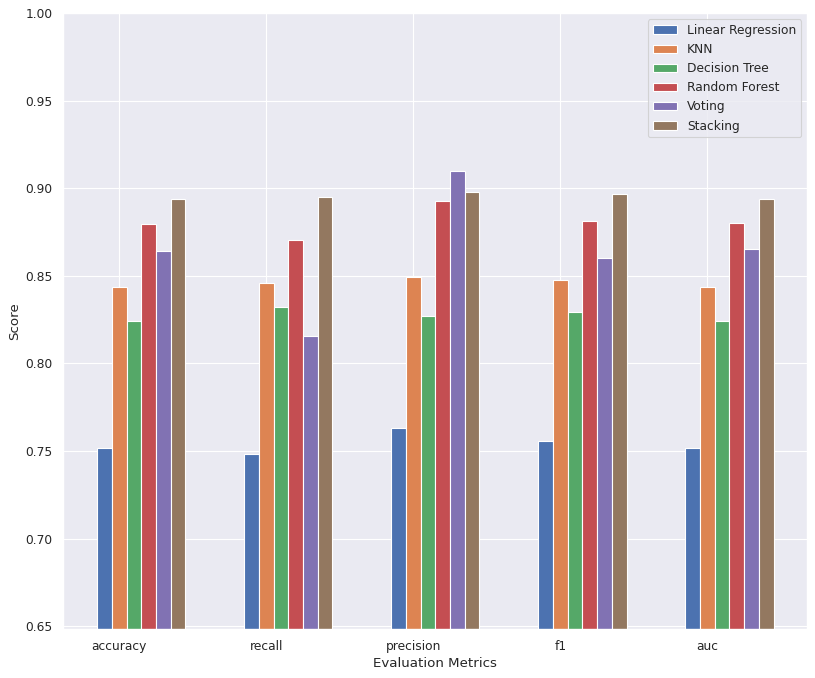
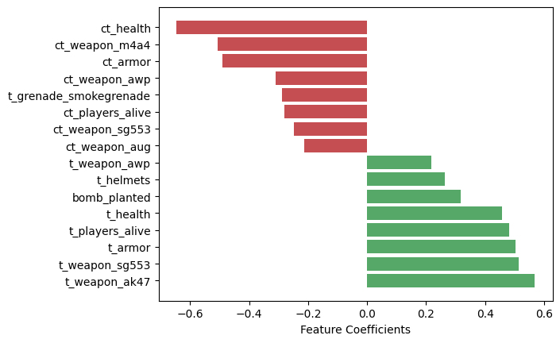

# CS:GO Round Winner Prediction: Executive Summary for Chief Data Officer

## Executive Summary

This document outlines an analysis focused on predicting round outcomes in Counter-Strike: Global Offensive (CS:GO) to provide actionable insights for strategic decision-making. Leveraging a comprehensive dataset of high-level tournament play, we developed and evaluated various machine learning models. The **Stacking ensemble model** emerged as the most accurate predictor (89.3% accuracy), offering superior performance despite a longer training time. Key findings highlight the critical importance of **player survivability (health and armor)**, **weapon advantage**, and **objective control (bomb plant)** as primary drivers of round victory. These insights can inform strategic adjustments for professional teams, guide game development, and enhance esports analysis. We recommend deploying the Stacking model and exploring advanced explainable AI techniques and temporal feature engineering for deeper insights.

## Business Objectives

This analysis focuses on **interpretation**, identifying features predictive of CS:GO round victory. This interpretability-focused approach provides significant benefits to various stakeholders:

*   **Professional Teams and Coaches:** Gain insights into key factors influencing round outcomes for strategic decision-making and tactical adjustments.
*   **Game Developers:** Understand the impact of game mechanics on outcomes to inform future design and updates.
*   **Esports Analysts and Commentators:** Enhance analytical commentary with data-driven insights.

## Dataset Overview

This dataset is derived from the tactical shooter game Counter-Strike: Global Offensive (CS:GO) and is intended for machine learning classification tasks, specifically predicting the round winner. It comprises approximately 122,000 "round snapshots" from high-level tournament play in 2019-2020, capturing the state of live rounds. Each snapshot is independent, allowing for individual prediction.

## Data Preparation

**Data Exploration**:
- The dataset contains 96 features and a `round_winner` target variable, with no missing data across 122,410 entries.
- Features include `map` (categorical), `bomb_planted` (boolean), and numerous continuous variables.
- The dataset exhibits a balanced distribution of round wins between Terrorist and Counter-Terrorist teams.
- Individual features show moderate correlation with the `round_winner` target variable.

**Feature Engineering**:
- The `map` feature was one-hot encoded, and all features were cast to float data type.
- All features were scaled using `StandardScaler` to ensure consistent input for models.

## Model Training and Selection

Our primary optimization metric was **accuracy**, as both true positive and true negative predictions are equally critical for this classification task.

The following table presents the performance metrics for various models trained with their default parameters:

| Model Name | Accuracy | Recall | Precision | F1 Score | AUC |
| :---------------- | :------- | :----- | :-------- | :------- | :----- |
| Linear Regression | 0.7517 | 0.7483 | 0.7634 | 0.7558 | 0.7518 |
| KNN | 0.8438 | 0.8459 | 0.8492 | 0.8475 | 0.8437 |
| Decision Tree | 0.8235 | 0.8317 | 0.8258 | 0.8287 | 0.8233 |
| Random Forest | 0.8795 | 0.8714 | 0.8916 | 0.8813 | 0.8798 |
| Voting | 0.8644 | 0.8157 | 0.9108 | 0.8607 | 0.8657 |
| Stacking | 0.8929 | 0.8917 | 0.8989 | 0.8953 | 0.8929 |

The **Stacking** model demonstrated the best baseline performance. While it had a longer training time (5 minutes) compared to Random Forest (40 seconds), its superior accuracy (89.3% vs. 87.9%) justified its selection. Due to computational expense, extensive hyperparameter tuning was focused solely on the Random Forest model, which showed only marginal improvement and still performed below the Stacking model.

Therefore, we recommend utilizing the **Stacking** model for its robust predictive performance, achieved by combining simpler models into a sophisticated ensemble.

### Feature Importance

Feature importance analysis revealed several critical factors influencing round outcomes:

*   **Player Survivability (Health and Armor):** The most dominant predictors of round success are the aggregate health and armor of players. Teams with higher collective health and armor are significantly more likely to win, indicating that sustained survivability and effective resource management are paramount.
*   **Weapon Advantage:** The presence and utilization of meta weapons (AK-47 for Terrorists, M4A4 for Counter-Terrorists) significantly increase a team's probability of winning the round. This highlights the strategic importance of weapon control and economic management.
*   **Objective Control (Bomb Plant):** When the bomb is planted, the Terrorist team gains a substantial advantage, underscoring the importance of objective play in securing round victories.

## Key Findings and Strategic Insights

This analysis demonstrates that a sophisticated ensemble model like Stacking can achieve high predictive accuracy in CS:GO round outcome prediction. The Stacking model, despite its longer training time, consistently outperformed other models, making it the recommended choice.

The feature analysis provides actionable insights for various stakeholders:
*   **Strategic Prioritization:** Maintaining high collective health and armor should be a primary focus for teams, as it is the strongest predictor of round victory.
*   **Weapon Meta:** The impact of meta weapons (AK-47, M4A4) confirms their critical role in competitive play, suggesting that controlling these weapons or countering them effectively is crucial.
*   **Objective Play:** The significant influence of bomb plant on Terrorist wins reinforces the importance of executing and defending bomb sites.

## Recommendations and Future Work

To further enhance the model's interpretability and predictive power, consider the following:

*   **Temporal Feature Engineering:** Explore time-series aspects of the data, such as changes in player health or economic shifts between snapshots, to capture dynamic round progression.
*   **Advanced Explainable AI (XAI) Techniques:** Apply methods like SHAP or LIME to provide localized explanations for individual predictions, offering more nuanced tactical insights for specific scenarios.
*   **Ensemble Optimization:** Further optimize the Stacking model by experimenting with different combinations of base learners or meta-learners to potentially yield even better results.
