# Deep Learning Project: Cat Feature Identification with CNN

## 1. Main Objective

The main objective of this project is to develop a Deep Learning model to accurately identify key facial features in images of cats. Specifically, we will use a Convolutional Neural Network (CNN) to predict the coordinates of nine distinct points: the left eye, right eye, mouth, and six points outlining the ears.

This analysis can provide significant value to various business applications. For instance, it could be integrated into social media platforms for creating augmented reality filters for pets, used in photo management applications for automatic tagging and organization of pet pictures, or even adapted for veterinary purposes to assist in diagnostics by tracking facial symmetry or changes over time.

## 2. Data Description

### About the Dataset

This project utilizes the CAT dataset, which contains over 9,000 images of cats. Each image is paired with an annotation file that provides the coordinates for nine specific facial landmarks.

Each image is paired with an annotation that provides the coordinates for nine specific facial landmarks. These coordinates serve as the prediction columns for the model:
*   Left Eye (x, y)
*   Right Eye (x, y)
*   Mouth (x, y)
*   Left Ear-1 (x, y)
*   Left Ear-2 (x, y)
*   Left Ear-3 (x, y)
*   Right Ear-1 (x, y)
*   Right Ear-2 (x, y)
*   Right Ear-3 (x, y)

The distibution of these points in dataset (already normally distributed)

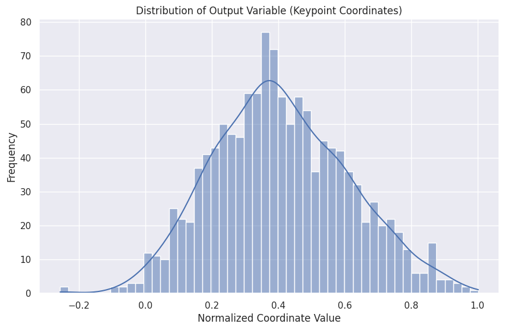

## 3. Data Exploration, Cleaning, and Feature Engineering

The initial phase involved exploring the dataset to understand its structure and contents. This included examining the images and their corresponding keypoint annotations.

Below are some sample images from the training and testing sets, with the ground truth keypoints overlaid.

**Sample Images from the Dataset**

*   **Train Samples:** 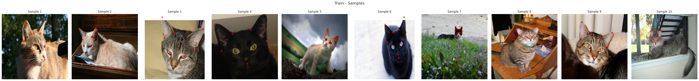
*   **Test Samples:** 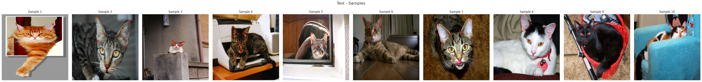

The data preprocessing steps were as follows:
-   **Image Resizing:** All images were resized to a consistent dimension of 224x224 pixels to be fed into the CNN.
-   **Pixel Value Normalization:** The pixel values of the images were scaled from their original 0-255 range to a [0, 1] range.
-   **Keypoint Normalization:** The keypoint coordinates were normalized to be relative to the image size, making the model's predictions independent of the original image dimensions.

## 4. Model Training

Three different CNN models were trained to find an effective architecture for this keypoint regression task.

### Model Variation 1: Baseline CNN

\pagebreak
**Training History** 

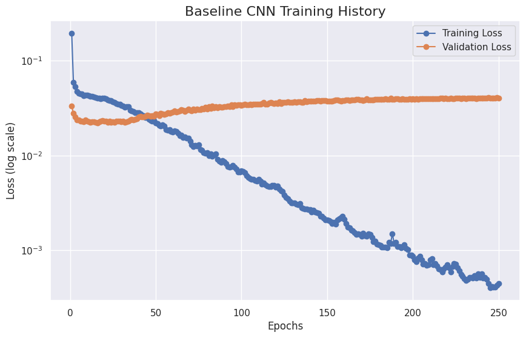

**Predictions**

*   **Train Set Predictions:** 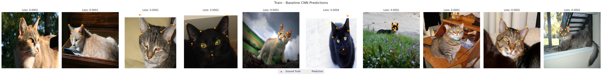
*   **Test Set Predictions:** 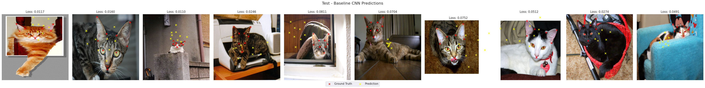

### Model Variation 2: Deeper CNN

To improve upon the baseline, a much deeper and more complex CNN was implemented. This model features multiple blocks of convolutional layers with batch normalization and dropout to prevent overfitting.

\pagebreak
**Training History** 

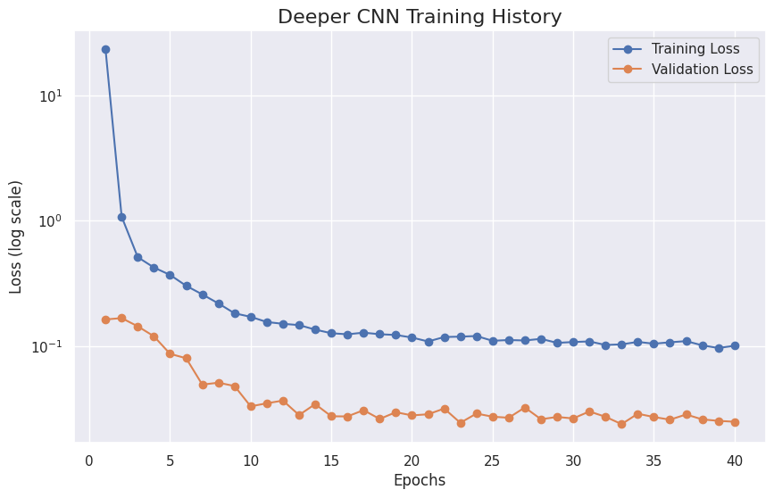

**Predictions**

*   **Train Set Predictions:** 
*   **Test Set Predictions:** 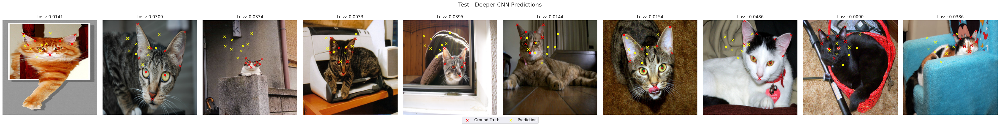

### Model Variation 3: CNN with Autoencoders

This approach involved a two-stage process. First, an autoencoder was trained on the cat images to learn a compressed, lower-dimensional representation of them. The encoder part of this autoencoder was then used as a feature extractor, and a new regression head was trained on top of these features to predict the keypoints.

\pagebreak
**Autoencoder Training History** 

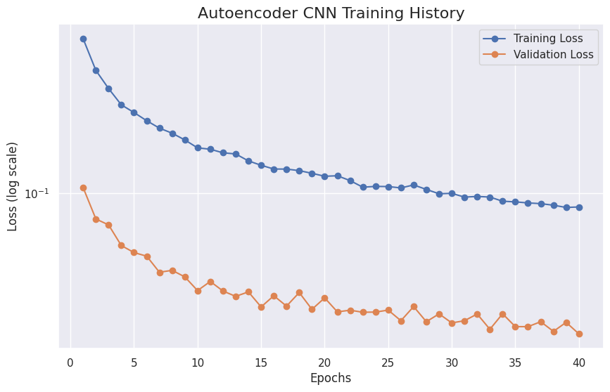

\pagebreak
**Autoencoder CNN Regressor Training History** 

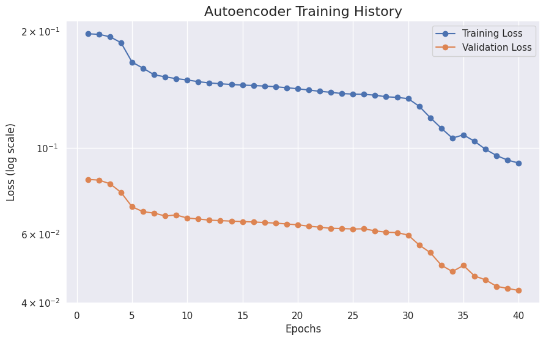

**Predictions**

*   **Train Set Predictions:** 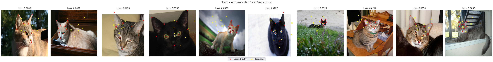
*   **Test Set Predictions:** 

## 5. Final Model Selection

Among the three models trained, none fully achieved the desired level of generalization or accuracy due to various challenges, primarily computational constraints and model complexity. However, based on the insights gained, the **Deeper CNN** model shows the most promise for future development, despite its current underfitting.

*   **Baseline CNN:** While the simplest and fastest to train (up to 250 epochs), this model exhibited significant overfitting, failing to generalize well to unseen validation data. Its simplicity limited its capacity to capture the intricate patterns required for accurate keypoint prediction.
*   **Deeper CNN:** This more complex architecture, despite being computationally intensive and only trained for 40 epochs, demonstrated an ability to learn more complex features. Its current underfitting suggests that with sufficient computational resources and extended training, it has the potential to achieve better performance and generalization. The initial learning trends indicate that it was still improving at the point training was halted.
*   **CNN with Autoencoders:** This ensemble approach, while conceptually interesting for feature extraction, also underperformed. The autoencoder's latent variable representation did not seem to capture enough relevant information for the subsequent regression task, leading to poor performance on both training and test data. Its complexity also limited the training duration to 40 epochs.

Therefore, the Deeper CNN is selected as the foundation for future work. Its architecture is inherently more capable of handling the complexity of image feature extraction for regression, and its current limitations appear to stem from insufficient training rather than fundamental architectural flaws.

## 6. Key Findings and Insights

The process of developing and training these deep learning models for cat facial keypoint identification yielded several critical insights:

*   **Computational Resource Dependency:** Achieving high accuracy in deep learning tasks, especially those involving image processing and complex models, is heavily dependent on significant computational resources. The limited access to extended GPU time (even on Google Colab) severely restricted the training duration for the more complex models (Deeper CNN and Autoencoder), leading to underfitting or suboptimal performance.
*   **Training Dynamics of CNNs:** Even a relatively basic CNN (Baseline) can learn image features, but it requires extensive training. Observations showed that while initial improvements were rapid, performance continued to subtly improve even after 20 epochs, indicating that longer training schedules are often necessary, up to a certain point, to fully converge and minimize error.
*   **Complexity vs. Training Time Trade-off:** Increasing model complexity (e.g., Deeper CNN) introduces the potential for capturing more nuanced patterns but drastically increases training time. Without adequate resources, this complexity can lead to underfitting, as the model does not have enough time to learn from the data effectively.
*   **Feature Representation Challenges:** The autoencoder approach highlighted the challenge of learning effective latent representations for downstream tasks. While autoencoders are powerful for dimensionality reduction, ensuring the encoded features are rich enough for a specific regression task (like keypoint prediction) requires careful design and validation of the autoencoder's architecture and training.

Overall, the task proved more challenging than initially anticipated, primarily due to the interplay between model complexity, data volume, and available computational power.

## 7. Next Steps and Future Work

To address the limitations encountered and further enhance the model's performance, the following next steps are recommended:

*   **Leverage Transfer Learning:** Implement a pre-trained Convolutional Neural Network (CNN) such as VGG16, ResNet, or EfficientNet. These models have learned robust feature representations from vast image datasets (e.g., ImageNet) and can serve as powerful feature extractors, significantly reducing the need for extensive training from scratch and potentially improving generalization with fewer computational resources.
*   **Advanced Hyperparameter Tuning:** Employ more sophisticated hyperparameter optimization techniques beyond manual tuning, such as Grid Search.
*   **Data Augmentation:** Implement aggressive data augmentation techniques (e.g., random rotations, shifts, zooms, flips, brightness changes) to artificially expand the training dataset. This will help the model learn more robust features, reduce overfitting, and improve generalization to varied cat poses and lighting conditions.
*   **Explore Different Loss Functions:** Investigate alternative loss functions that might be more suitable for keypoint regression, such as Smooth L1 loss (Huber loss) which is less sensitive to outliers than Mean Squared Error (MSE).
*   **Increase Computational Resources:** Secure access to more powerful GPUs or cloud computing resources to allow for longer training durations and experimentation with larger, more complex models.
*   **Error Analysis and Targeted Improvements:** Conduct a detailed error analysis on the current model's predictions. Identify specific types of images or keypoints where the model performs poorly and use these insights to guide further model refinements or data collection efforts.
*   **Collect More Diverse Data:** While the current dataset is substantial, acquiring more diverse images of cats (different breeds, angles, lighting, backgrounds) could further improve the model's robustness and generalization capabilities.

### Identified Flaws and Limitations

Based on the current state of the project, the primary flaws and limitations are:

*   **Computational Resource Dependency:** The models, especially the more complex ones, require significant computational power for adequate training, which was a limiting factor. This led to under-trained models that did not fully converge or generalize well.
*   **Suboptimal Generalization:** None of the models, particularly the Baseline and Autoencoder CNNs, demonstrated strong generalization to unseen data, indicating issues with overfitting or insufficient feature learning.
*   **Underfitting in Complex Models:** The Deeper CNN, while promising, underfit the data due to limited training time, preventing it from reaching its full potential.
*   **Feature Representation Inadequacy (Autoencoder):** The autoencoder's learned latent space did not provide a sufficiently rich representation for the keypoint regression task, suggesting that the autoencoder architecture or training strategy needs re-evaluation for this specific application.

